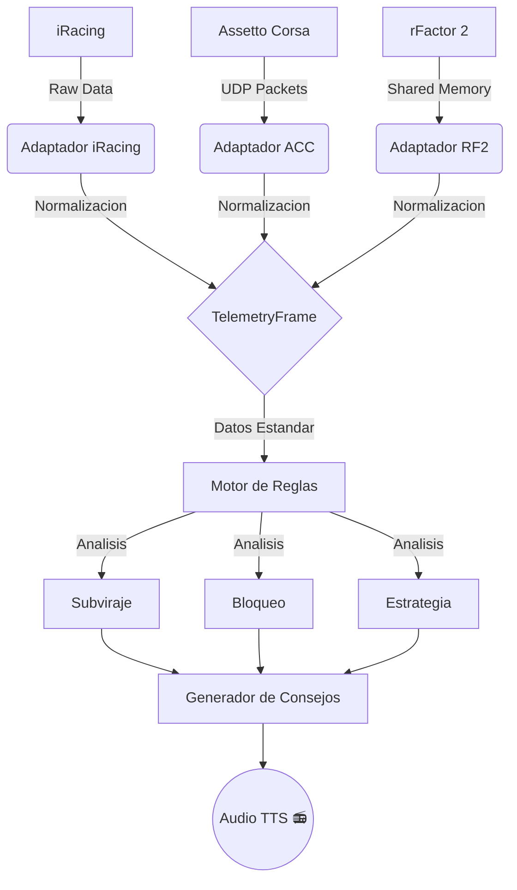

# Arquitectura de Normalización de Telemetría

Este documento detalla cómo **SimRacingCoach** logra ser agnóstico del simulador (compatible con iRacing, ACC, rFactor, etc.) mediante una capa de estandarización.

## 🔄 El Concepto: "Universal Translator"

El **Motor de IA (AI Engine)** utiliza el estándar `TelemetryFrame` para ser independiente del juego.

## 🛠️ Componentes Clave

1.  **`TelemetryFrame`** (`packages/core/src/types.ts`):
    *   Es el "contrato". Define qué datos *debe* tener el sistema.
2.  **`TelemetryRulesEngine`** (`packages/ai-engine`):
    *   Es el "cerebro".
    *   **NO sabe** qué juego se está ejecutando.
3.  **Adaptadores** (`packages/adapters/`):
    *   Actualmente activo: **iRacing Adapter** (`iracing-node`).
